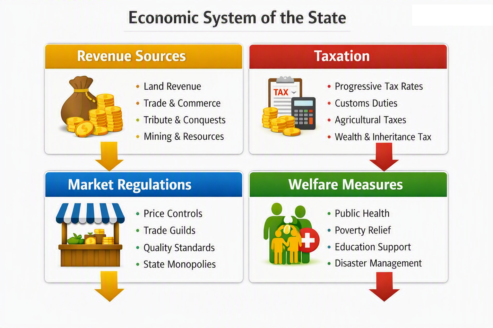

# Economic Thought

Chanakya’s economic philosophy emphasizes wealth creation, resource management, taxation, labor regulation, and market stability. His pragmatic approach integrates state intervention with market freedom, aiming to maximize prosperity and minimize exploitation.

Key themes include:
- Revenue systems and taxation models
- Agricultural and industrial productivity
- Trade, commerce, and market regulation
- Public finance and treasury management
- Welfare measures and poverty alleviation

Chanakya’s economic insights demonstrate a sophisticated understanding of macroeconomic and microeconomic principles long before modern economics emerged.

**Figure: Economic System of the State**  
This diagram presents Chanakya’s economic model, highlighting revenue sources, taxation, market regulations, and welfare measures.
