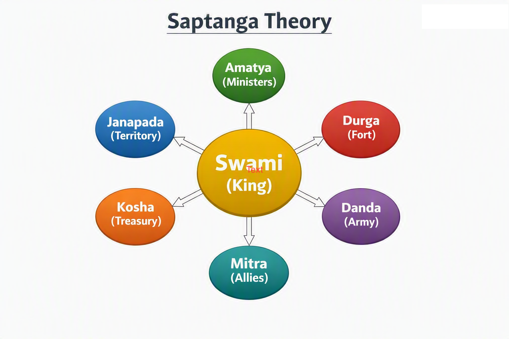
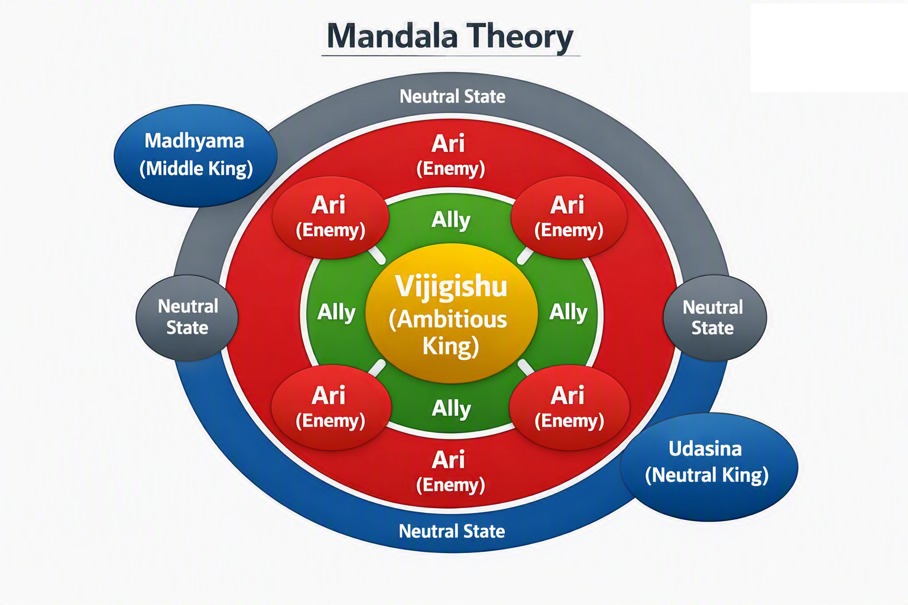

# Political Science Foundations

Chanakya’s political theory centers on the concept of the state (rajya), sovereignty, and the duties of the ruler. His framework includes the seven limbs of the state, diplomatic strategies, intelligence networks, and military organization.

Major concepts:
- The Saptanga theory of state
- Mandala theory (circle of states)
- Diplomacy, alliances, and conflict management
- Role of ministers and administrative hierarchy
- Internal security and external defense

Chanakya’s political science contributions remain relevant in discussions on realpolitik, strategic studies, and governance models.

**Figure: Saptanga Theory Diagram**  
This diagram illustrates Chanakya’s seven limbs of the state — Swami, Amatya, Janapada, Durga, Kosha, Danda, and Mitra — showing how each component supports stable governance.

**Figure: Mandala Theory Diagram**  
This diagram shows the Vijigishu (central king) surrounded by allies, enemies, middle kings, and neutral states arranged in concentric circles, representing Chanakya’s geopolitical strategy.
