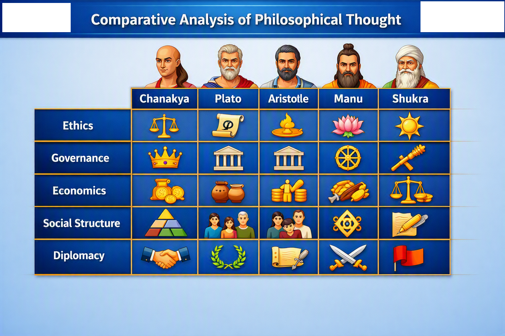

# Comparative Analysis

This section compares Chanakya’s ideas with:
- Indian Acharyas such as Manu, Shukra, and Brihaspati
- Greek philosophers including Plato and Aristotle

Comparative themes:
- Ethics and political morality
- State structure and governance
- Economic regulation and social order
- Leadership qualities and responsibilities

The analysis highlights both convergences and divergences, demonstrating Chanakya’s unique blend of pragmatism and philosophical depth.

**Figure: Comparative Analysis Chart**  
This chart compares Chanakya with Plato, Aristotle, Manu, and Shukra across themes like ethics, governance, economics, and social structure.
