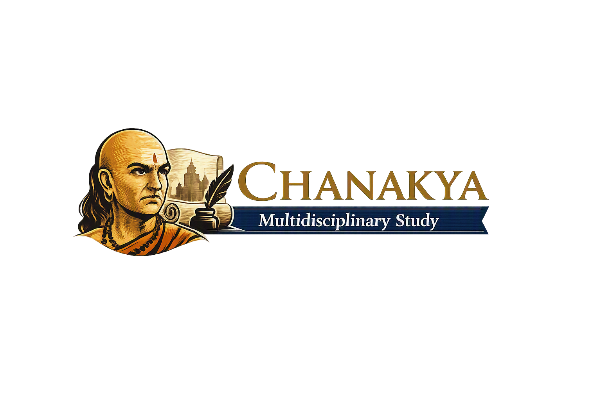

  

  

# Chanakya: A Multidisciplinary Study

A comprehensive research project analyzing Chanakya’s contributions to economics, political science, sociology, governance, and modern statecraft. This study examines the *Arthashastra*, compares Chanakya with Indian Acharyas and Greek philosophers, and explores how his principles appear in modern leadership and administrative systems.

---

## 📘 Project Overview
This repository presents a structured, academic exploration of Chanakya’s multidisciplinary thought. It includes chapter‑wise Markdown sections, diagrams, comparative charts, literature review, methodology, glossary, and appendices — making it suitable for academic reference, teaching, and research.

---

## 📂 Contents
- 01_Abstract.md  
- 02_Introduction.md  
- 03_Economic_Thought.md  
- 04_Political_Science.md  
- 05_Sociology.md  
- 06_Governance.md  
- 07_Comparative_Analysis.md  
- 08_Modern_Case_Studies.md  
- 09_Conclusion.md  
- 10_References.md  
- 11_Methodology.md  
- 12_Literature_Review.md  
- 13_Discussion.md  
- 14_Limitations.md  
- 15_Future_Research.md  
- Glossary.md  
- Appendix.md  
- List_of_Figures.md  
- List_of_Tables.md  

---

## 📦 Releases
- **v1.0 — Final Academic Edition**  
  Full release notes available in `/releases/Release_v1.0.md`.

---

## 🖼️ Visual Assets
All diagrams used in the study are located in the **/assets** folder:

- Saptanga Theory  
- Mandala Theory  
- Economic System  
- Governance Flowchart  
- Comparative Analysis Chart  

These visuals provide conceptual clarity and support the multidisciplinary analysis.

---

## 📑 Repository Structure
/paper        — Original research paper files (DOCX, PDF)
/sections     — Markdown versions of each chapter
/references   — Bibliography and citation files
/assets       — Diagrams, tables, and supporting visuals
/releases     — Version notes and roadmap files

---

## 📚 Academic Enhancements Included
This repository includes several academic‑grade additions:

- Full **Methodology** section  
- Comprehensive **Literature Review**  
- Detailed **Discussion** and **Limitations**  
- Forward‑looking **Future Research Directions**  
- Complete **Glossary** of Sanskrit and political terms  
- **Appendix** with extended notes  
- **List of Figures** and **List of Tables**  

These additions elevate the project to publication‑ready quality.

---

## 🔗 How to Cite
Navpreet (2026). *Chanakya: A Multidisciplinary Study*. GitHub Repository.  
https://github.com/navu-aman2025/Chanakya-Multidisciplinary-Study

---

## 📜 License
This project is released under the **MIT License**.  
See the LICENSE file for details.

---

## ✨ Acknowledgments
This project integrates classical Indian philosophy, modern academic frameworks, and structured research methodology. Special appreciation to open‑source tools, digital libraries, and scholarly translations that made this study possible.
